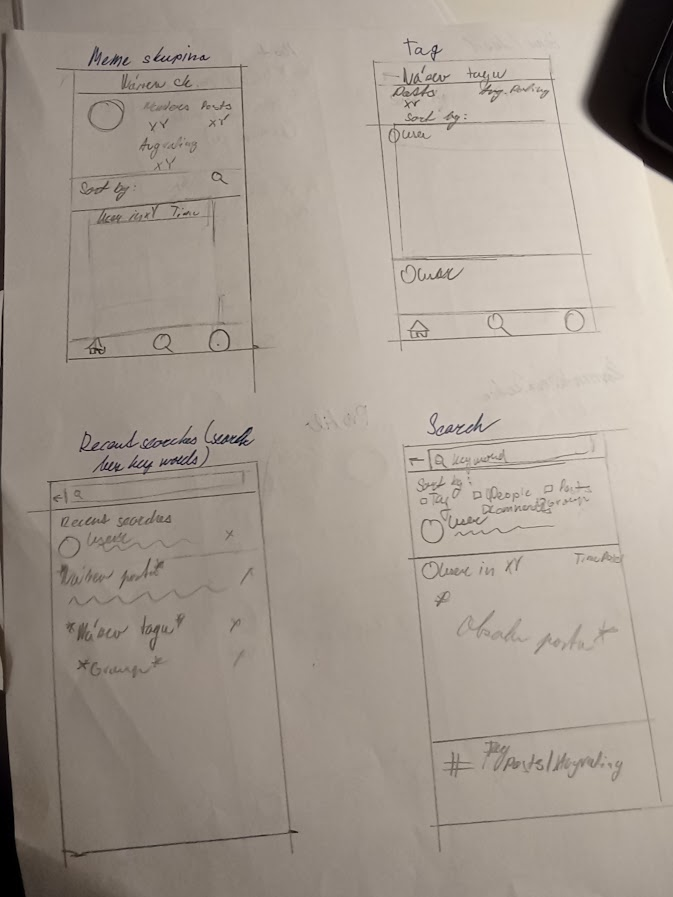
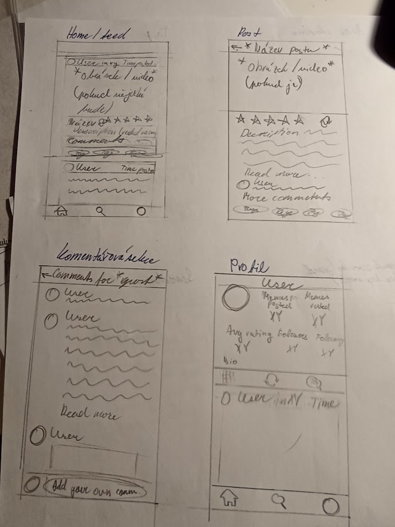
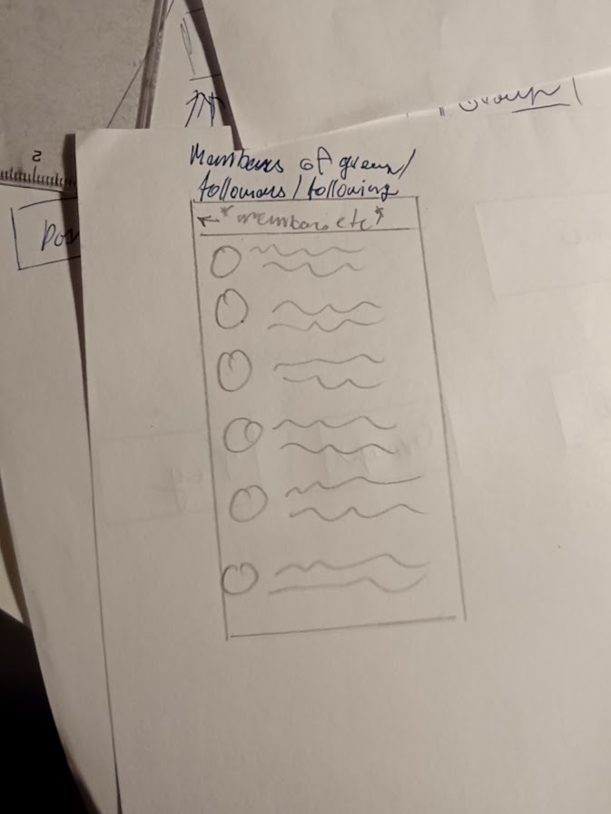
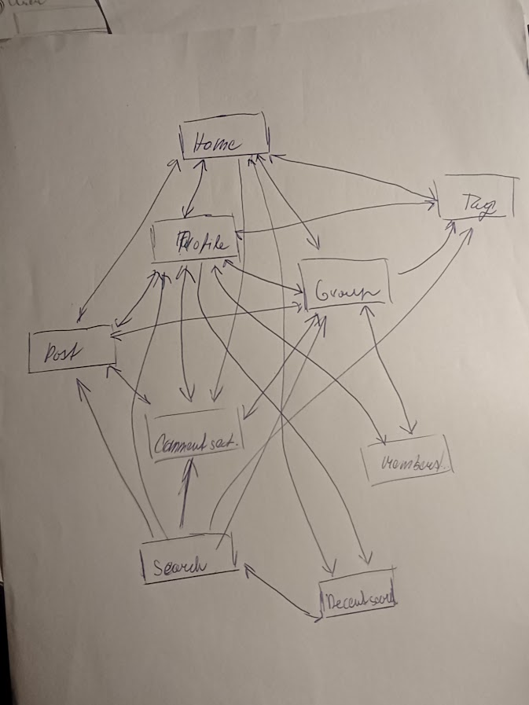
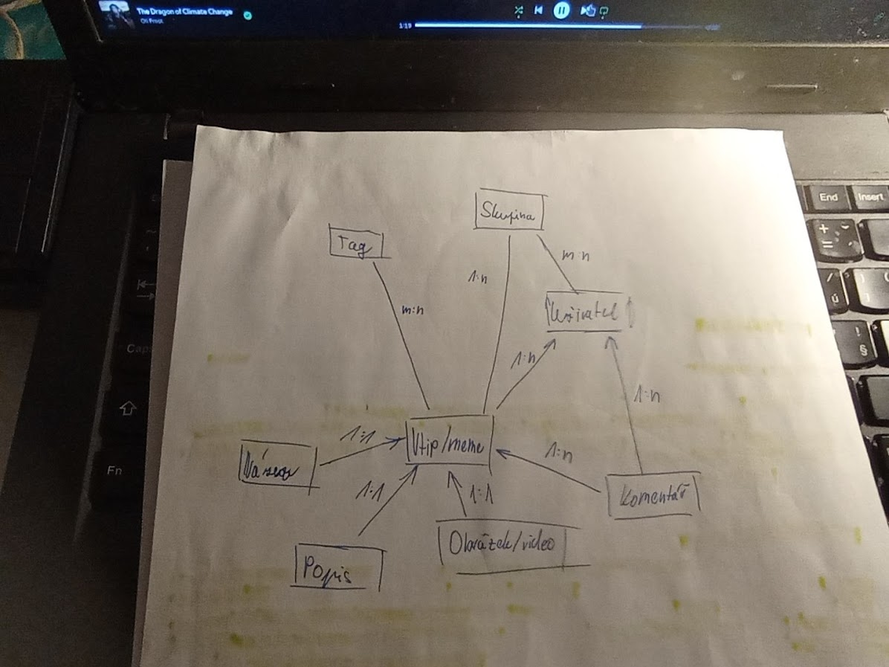

# Databáze memů a random vtipů ✨

Cílem <u>projektu</u> je vytvořit <u>distribuční uzel</u> zaměřený na <u>indexaci</u>, <u>ukládání</u> a <u>distribuci</u> digitálního humoru ve formě <u>textových vtipů</u>, <u>obrázkových vtipů</u> a <u>grafických memů</u>. <u>Architektura</u> <u>systému</u> počítá s nárazovým nárůstem <u>návštěvnosti</u> (např. při virálním šíření obsahu) a umožňuje plynulé <u>zapojení</u> <u>uživatelů</u> do tvorby <u>obsahu</u>.

V rámci <u>systému</u> definujeme tři hlavní <u>úrovně přístupu</u>. Anonymní návštěvník tvoří nejpočetnější <u>skupinu</u>. Jeho <u>aktivitou</u> je primárně <u>konzumace obsahu</u> prostřednictvím <u>prohlížeče</u>. Má k dispozici <u>moduly</u> pro <u>řazení</u> (podle <u>popularity</u> či <u>data vložení</u>) a <u>filtrování</u> na základě <u>metadat</u> a <u>klíčových slov</u>.<u>Přístup</u> neregistrovaných <u>subjektů</u> je sledován <u>analytickými nástroji</u>, aby bylo možné předcházet <u>přetížení</u> <u>serveru</u> a zajistit plynulé <u>vykreslování</u> <u>stránek</u>.

Po provedení <u>registrace</u> a následné <u>verifikaci</u> <u>identity</u> se subjekt stává registrovaným uživatelem. Tato <u>role</u> je klíčová pro <u>generování obsahu</u>. Uživatel může provádět <u>upload</u> <u>souborů</u>, přičemž <u>validátor</u> kontroluje <u>datový formát</u> a <u>rozlišení</u>. Registrovaný člen má <u>oprávnění</u> k <u>participaci</u> v <u>diskusi</u> a může ovlivňovat <u>rating</u> jednotlivých <u>položek</u> pomocí <u>hlasování</u>. Všechny tyto <u>akce</u> jsou zaznamenávány do <u>relační struktury</u> <u>databáze</u>, což umožňuje tvorbu <u>žebříčků</u> a personalizovaný <u>feed</u>.

Nejvyšší <u>hierarchii</u> zaujímá administrátor, který dohlíží na <u>integritu</u> a <u>bezpečnost</u> celého <u>ekosystému</u>. Jeho hlavní <u>činností</u> je <u>moderace</u> nahraného <u>materiálu</u>, aby byl v souladu s <u>podmínkami užití</u>. Administrátor definuje a upravuje <u>stromovou strukturu</u> <u>témat</u> a <u>tagů</u>, čímž udržuje <u>konzistenci</u> <u>strukturu ténat</u> celého <u>portálu</u>. Pravidelná <u>optimalizace</u> <u>databázových dotazů</u> a <u>reindexace</u> <u>vyhledávacího modulu</u> zajišťuje, že <u>uživatel</u> dostane <u>výsledky</u> <u>hledání</u> v řádu milisekund.

